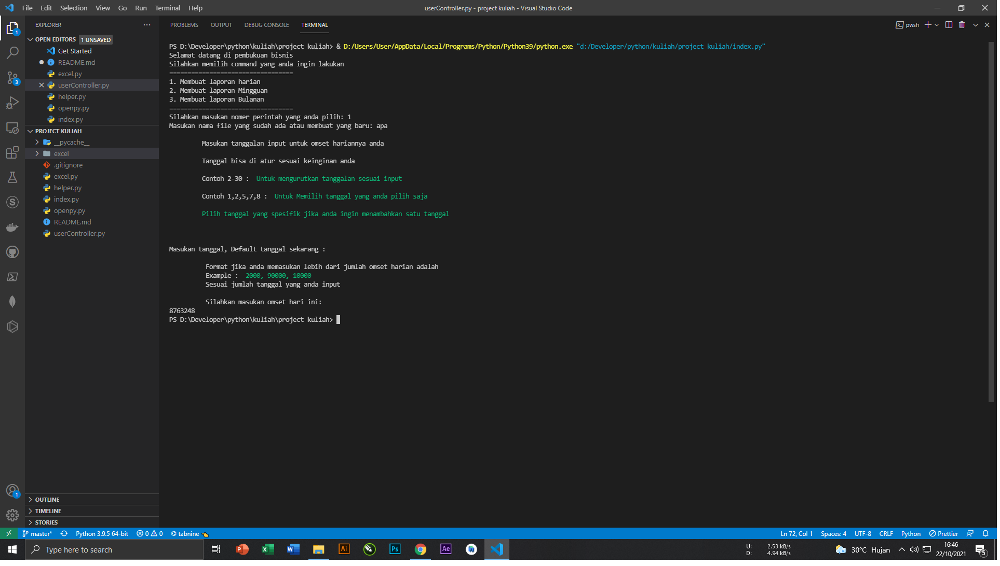

# Project Kuliah

### Membuat pembukuan keuangan bisnis dengan excel otomatis 

1. Buka terminal dan ketik ``` python index.py ```
2. Maka akan terbuka terminal dan memilih list pilihan, anda bisa memilih list tersebut



#### Bug 

check sheet which exist

#### Resource

  - Openpyxl
  - pandas
  - numpy
  - colorama

---

#### Author

- Mohammad Ardi Trisnaldi

#### Demo Repl


